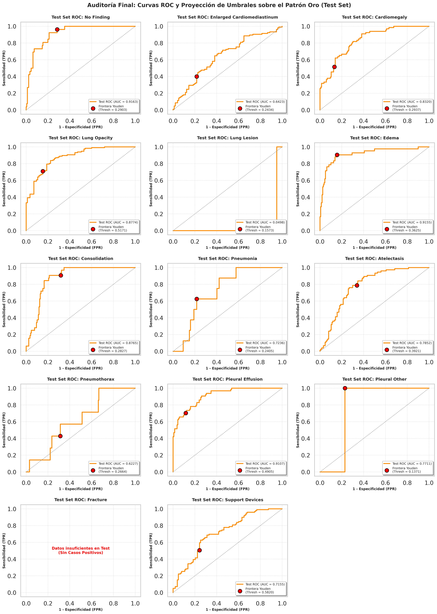
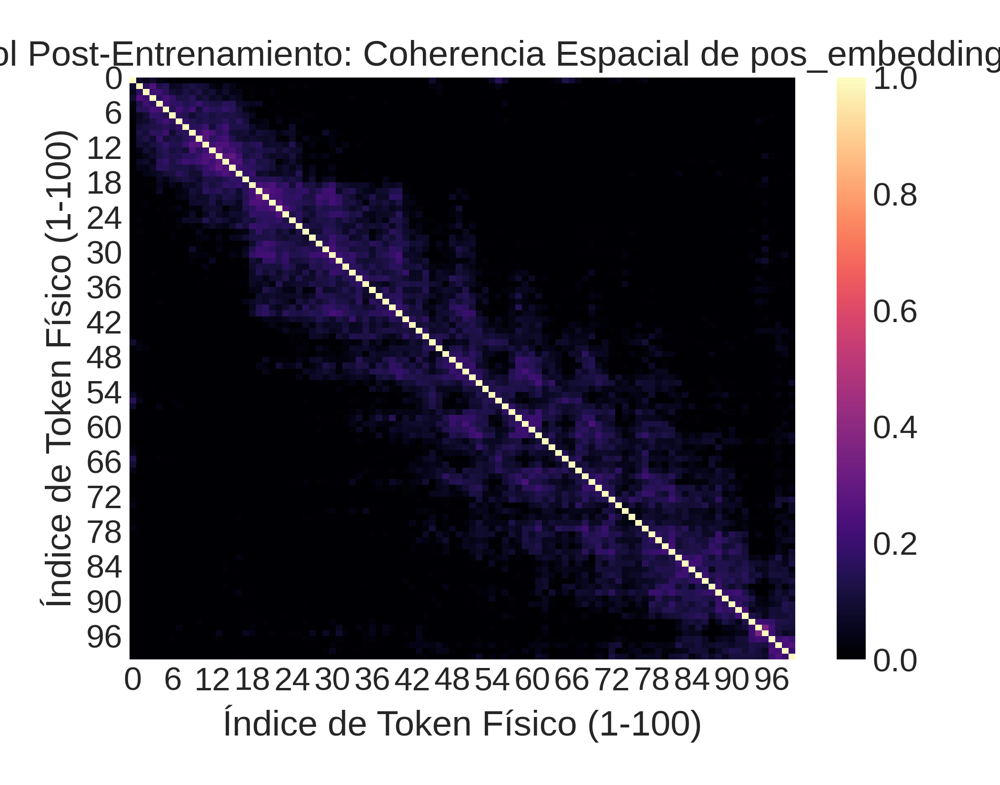
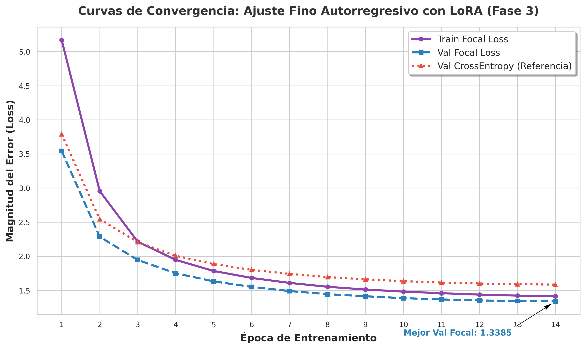

# 🧠 Vision-Language Model para Generación de Informes Clínicos Radiológicos

Proyecto de Fin de Grado en Ingeniería Informática (ETSIIT - UGR)  
**Autor:** Rafael Carrillo Arroyo

---

## 📋 Resumen Ejecutivo
Este proyecto implementa un pipeline multimodal avanzado que fusiona visión por computador y procesamiento de lenguaje natural (NLP) para la redacción autorregresiva de informes radiológicos. El sistema aborda los desafíos del **sesgo de normalidad** y la **desalineación de dominio** mediante una arquitectura dividida en tres fases de ingeniería estricta.

---

## 🏗️ Arquitectura del Sistema: Pipeline de 3 Fases

### FASE 1: Codificador Visual Clínico (Extractor Espacial)
**Objetivo:** Construcción de unos cimientos visuales universales y robustos que codifiquen la anatomía radiológica preservando estrictamente la topología espacial, generando el vocabulario base para el modelo generativo.

**Estrategia Arquitectónica y de Optimización:**
* *Backbone Médico:* Adaptación de una red **DenseNet121** mediante *Weight Surgery* (trasplante de pesos preentrenados y adaptación a entrada monocanal).
* *Preservación Topológica:* Se extirpa deliberadamente la capa de *Global Average Pooling* extrayendo una **cuadrícula espacial de 10x10** (100 tokens visuales continuos de 1024 canales) capaz de aislar regiones anatómicas concretas.
* *Blindaje Estadístico:* Aprendizaje multietiqueta en paralelo (14 patologías) combatiendo el desbalanceo extremo (*Long-Tail*) mediante pérdida asimétrica ponderada (BCE + Pos-Weight) y mapeo de incertidumbre clínico (*Soft Targets*).

**Resultados Finales (Macro-AUC Global: 0.741):**
* **Éxito Geométrico:** Rendimiento de nivel clínico en anomalías macroscópicas (AUC > 0.91 en Derrame Pleural y Edema). 

> **Auditoría Visual (Grad-CAM) y Rendimiento:**
> 
> 
> *La auditoría visual certifica la ausencia de atajos predictivos (Shortcut Learning), demostrando una focalización exacta sobre la patología real.*

---

### FASE 2: Ciclo Completo de Alineamiento Geométrico-Generativo (Puente Multimodal)
**Objetivo:** Operar como nexo entre el extractor visual congelado y el decodificador de lenguaje (BioGPT), proyectando la matriz espacial $\mathbb{R}^{100\times1024}$ hacia la sintaxis del modelo base mediante la inyección de *Embeddings* Posicionales 2D ($\mathbf{p}$).

**Dinámica de Optimización y Blindaje Matemático:**
* **Optimización Híbrida:** Pérdida compuesta $\mathcal{L}_{\text{total}} = \mathcal{L}_{\text{CE}} + \lambda_{\text{geom}}\cdot\mathcal{L}_{\text{geom}}$ ($\lambda=0.4$). Ejecución bajo Precisión Mixta (AMP) y AdamW.
* **Mitigación del Desbalance Energético:** `LayerNorm` restringe la norma L2 de cada token visual a $\sqrt{1024} = 32.0$, previniendo la muerte del gradiente por saturación.
* **Destrucción de Anisotropía:** Centrado dinámico de la media ($v-\mu$) para mitigar el *Efecto Cono* de los modelos autorregresivos.

**Resultados de la Auditoría Multicliente (Validación $N=380$):**
* **Estabilidad Energética:** Preservación absoluta del LLM ($\text{Max-Diff} = 0.00$) con norma L2 visual estabilizada en $32.21$.
* ⚠️ **Confirmación de Ceguera Clínica (Sesgo de Normalidad):** Tasa Macro de Captura Patológica crítica del **6.69%**. El modelo ignora lesiones severas convergiendo en reportes de normalidad genéricos debido a la dominancia del *prior* lingüístico de BioGPT congelado.

> **Evolución del Espacio Latente:**
> 
> *Resolución de la Paradoja del Centrado: Dispersión isótropa óptima alcanzada durante la validación dual.*

---

### FASE 3: Sincronización Clínica Autorregresiva (LoRA y Focal Loss)
**Objetivo:** Superar el Sesgo de Normalidad de la Fase 2 dotando a **BioGPT** de adaptabilidad diagnóstica fina, aprovechando su mente médica preentrenada (PubMed) sin destruir la geometría del espacio latente estabilizado.

**Estrategia Quirúrgica:**
* **Intercepción PEFT/LoRA:** Rango ampliado ($r=32, \alpha=64$) dirigido a la corteza atencional (`q_proj`, `k_proj`, `v_proj`, `out_proj`), ajustando solo un $\approx 1.5\% - 2\%$ de los parámetros para prevenir el olvido catastrófico.
* **Estabilización del Gradiente:** Uso de **Focal Loss Autorregresiva** ($\gamma=2.0, \alpha=1.0$) para destruir la inercia estadística de los tokens sanos.

**Resultados Consolidados (Cohorte Ciega $N=380$):**
* **Soberanía Visual:** Índice de Dependencia Visual (**Macro-VDI**) de **0.8333**. El 83.33% de la variabilidad lexicográfica está gobernada por los píxeles.
* **Disociación Metrológica NLG:** Convergencia semántica profunda alcanzando un **BERTScore F1 de 0.8777**.
* **Relevancia Clínica (BART Zero-Shot NLI):** Rendimiento SOTA en patologías sólidas: Opacidad Pulmonar (**78.94%**), Consolidación (**73.03%**) y Alteraciones Pleurales (**71.08%**). 

> **Convergencia y Reportes Clínicos (NLG & NLI):**
> 
> *Tablas detalladas de la evaluación final:*
> - 📄 [Ver Métricas de Generación NLG (BLEU, ROUGE, BERTScore)](assets/Resultados_Evaluacion/Modulo_3/metricas_generacion_nlg.csv)
> - 🏥 [Ver Resultados de la Auditoría Clínica BART NLI](assets/Resultados_Evaluacion/Modulo_3/resultados_auditoria_F1_BART_fase3.csv)
> - 🔬 [Ver Métricas Clínicas Finales](assets/Resultados_Evaluacion/Modulo_3/metricas_clinicas_bart.csv)

---

## 📂 Recursos y Estructura del Repositorio

🔗 **[Acceso al Google Drive del Proyecto (Datasets y Pesos)](https://drive.google.com/drive/folders/190Xspevq_DuxQ3TelS3kAR5PC_xw6rMz?usp=sharing)**

```text
TFG-Vision-Language-Clinical-Reports/
├── notebooks/       # Cuadernos modulares ejecutables (Fase 1, 2 y 3)
├── assets/          #
│   ├── Resultados_EDA/         # Gráficas de análisis exploratorio (CheXpert & Indiana)
│   └── Resultados_Evaluacion/  # Matrices, curvas ROC y métricas (Módulo 1, 2 y 3)
├── checkpoints/     # [Drive] Tensores de pesos (.pth) y adaptadores LoRA
├── data/            # [Drive] Espacio SSD para datasets clínicos estructurados
├── outputs/         # [Drive] Logs brutos
└── README.md        # Documentación arquitectónica