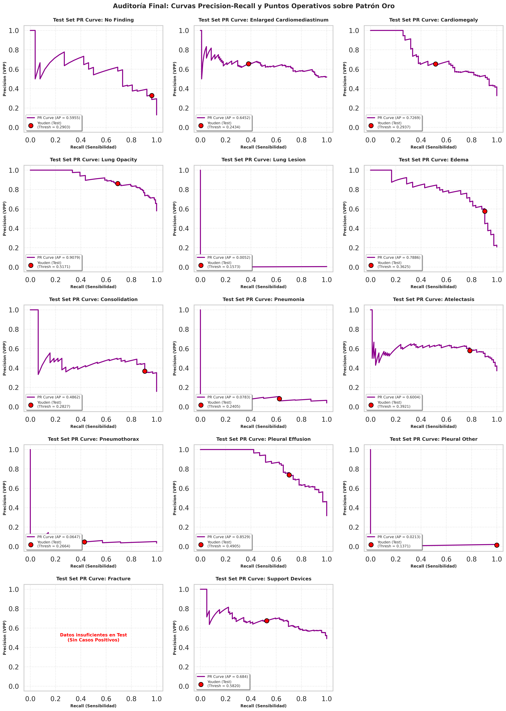
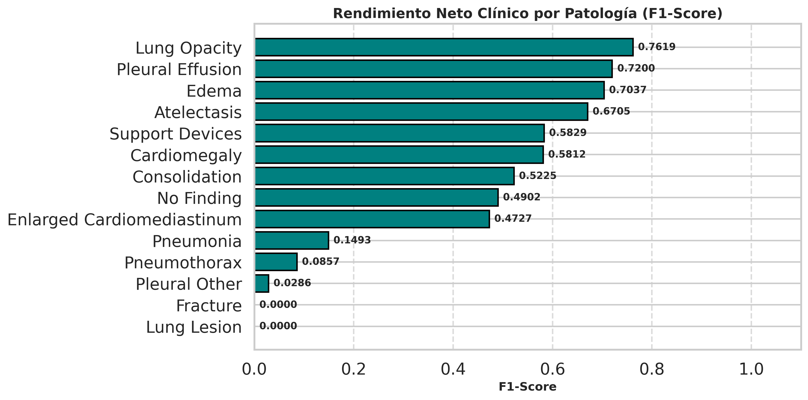
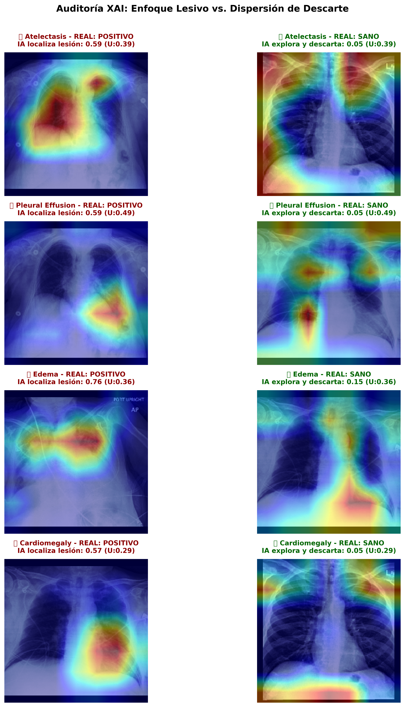
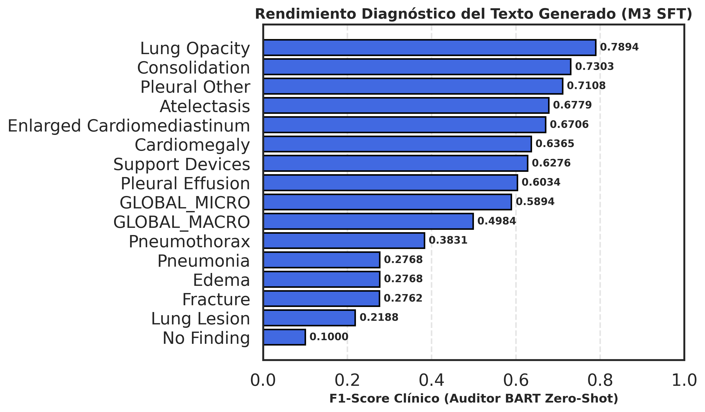
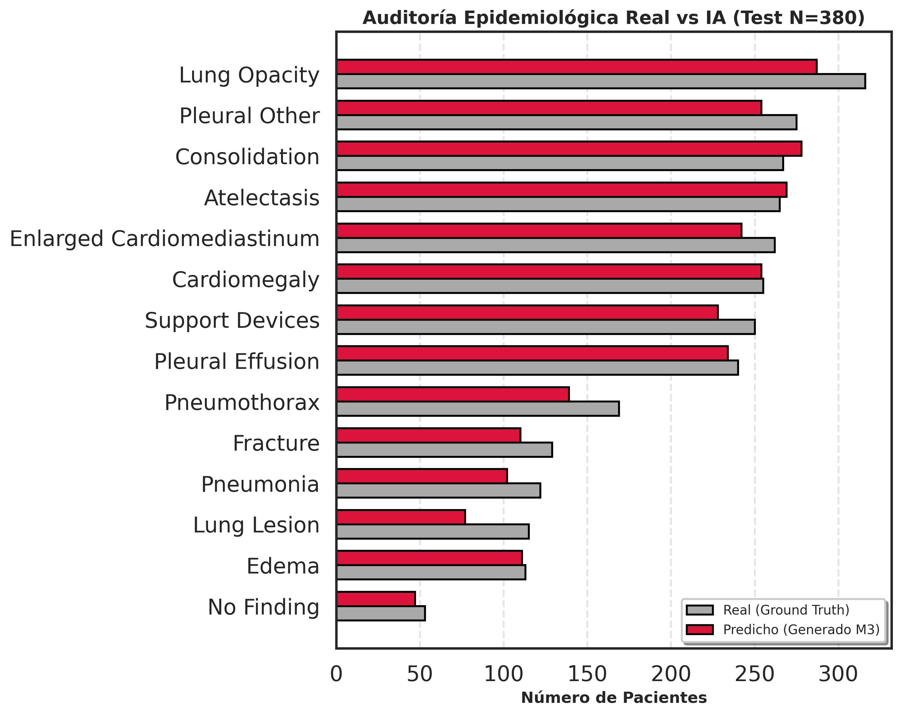

# 🧠 Vision-Language Model para la Generación Autorregresiva de Informes Radiológicos

**Proyecto de Fin de Grado en Ingeniería Informática (ETSIIT - Universidad de Granada)**  
**Autor:** Rafael Carrillo Arroyo

---

## 📋 Resumen Ejecutivo
La presente memoria detalla el diseño, desarrollo y evaluación empírica de un *pipeline* multimodal avanzado que integra visión por computador y procesamiento de lenguaje natural (NLP) para la redacción automatizada de informes radiológicos. El sistema aborda y mitiga los desafíos inherentes del **sesgo de normalidad** (*prior* lingüístico) y la **desalineación de dominio** mediante una arquitectura modular dividida en tres fases de ingeniería estricta y auditoría continua.

---

## 🏗️ Arquitectura del Sistema: Pipeline de 3 Fases

### FASE 1: Codificador Visual Clínico (Extracción de Características Espaciales)
**Objetivo:** Desarrollar una arquitectura base visual y robusta capaz de codificar la anatomía radiológica preservando la topología espacial, generando así un vocabulario fundacional para el modelo generativo.

**Estrategia Arquitectónica y de Optimización:**
* **Backbone Médico:** Adaptación de una red convolucional **DenseNet121** mediante *Weight Surgery* (transferencia de pesos preentrenados y adaptación a entrada monocanal).
* **Preservación Topológica:** Sustitución de la capa de *Global Average Pooling* convencional para extraer una **cuadrícula espacial de 10x10** (100 tokens visuales continuos de 1024 canales), aislando regiones anatómicas específicas.
* **Mitigación del Desbalanceo:** Aprendizaje multietiqueta concurrente (14 patologías) para combatir el desbalanceo extremo (*Long-Tail*) mediante la aplicación de una función de pérdida asimétrica ponderada (BCE + Pos-Weight) y el mapeo de incertidumbre clínica (*Soft Targets*).

**Rendimiento Global y Robustez (Cohorte de Test):**
El modelo demuestra una alta capacidad de separación estadística global, manteniendo la integridad estructural frente a la prevalencia masiva de clases sanas, tal como certifica el análisis del área bajo la curva de precisión-exhaustividad (PR AUC).

<div align="center">
  
  
</div>

**Rendimiento Neto Clínico (F1-Score):**
El análisis sobre el conjunto de prueba confirma un rendimiento de grado clínico, exhibiendo su mayor fiabilidad diagnóstica en patologías parenquimatosas sólidas y derrames.

<div align="center">
  
</div>

📄 **[Consultar tabla completa de métricas clínicas y umbrales (CSV)](assets/Resultados_Evaluacion/Modulo_1/test/metricas_clinicas_test.csv)**

> **Explicabilidad y Auditoría Visual (Grad-CAM):**
> 
> *El mapeo térmico de activación certifica que la red localiza la patología anatómica real (ej. Derrame Pleural, Edema, Atelectasia) de forma matemática, evadiendo correlaciones espurias o sesgos instrumentales (Shortcut Learning).*

---

### FASE 2: Puente Multimodal y Alineamiento Geométrico
**Objetivo:** Establecer el nexo de proyección entre el extractor visual y el decodificador de lenguaje (BioGPT). Esta fase opera bajo un protocolo de "Alineamiento Puro": el LLM se mantiene estrictamente congelado, recayendo la responsabilidad de proyectar la semántica visual hacia el espacio sintáctico en un perceptrón multicapa (MLP) asistido por *Embeddings* Posicionales 2D.

**Validación Arquitectónica y Estabilidad (Cohorte Test N=380):**
El diseño del puente multimodal (MLP + LayerNorm + Centrado Dinámico) logra estabilizar la inyección visual sin producir saturación en la red receptora.
* **Inmutabilidad del LLM:** Diferencia máxima absoluta nula (`Max-Diff = 0.00`), garantizando la preservación de los pesos originales de BioGPT.
* **Estabilidad Energética:** Norma L2 acotada en **32.22**, previniendo la saturación matemática de la capa Softmax.
* **Mitigación del "Efecto Cono":** Reducción drástica de la similitud coseno centrada a **0.0005**, garantizando una dispersión isótropa óptima y mitigando la anisotropía inherente de los modelos de lenguaje.

> **Demostración Geométrica de la Coherencia Espacial:**
> <div align="center">
>   
> </div>
> 
> *La matriz de afinidad evidencia empíricamente el aprendizaje de una topología bidimensional sobre una secuencia plana. Las bandas paralelas a la diagonal principal reflejan correlaciones geométricas consistentes, demostrando que el proyector interioriza la estructura anatómica de la radiografía sin supervisión espacial explícita.*

**Análisis de Inercia Lingüística y "Ceguera Clínica":**
A pesar de la correcta alineación geométrica, la evaluación clínica arroja una **Tasa Macro de Captura Patológica crítica del 6.69%**. La conservación inmutable de BioGPT provoca que su fuerte sesgo lingüístico (*prior* de normalidad) eclipse la señal visual, resultando en la generación de informes genéricos de normalidad incluso ante evidencias de lesiones severas.

> **⚠️ Ejemplo de Alucinación por Sesgo de Normalidad (Paciente con fracturas y derrame):**
> * **[INFORME ORIGINAL]:** *"Findings: Cardiomediastinal contours are unchanged. There are stable fractures... Pleural effusion..."*
> * **[TEXTO GENERADO]:** *"Normal, the heart is in normal site. No cardiomegaly or pleural effusion. Impression: The chest is clear."*

**Veredicto Metodológico:** El alineamiento unimodal de proyección pura resulta insuficiente para quebrar la inercia del modelo de lenguaje. Este hallazgo empírico valida la hipótesis de partida y fundamenta la necesidad de la transición hacia la **FASE 3**, introduciendo adaptación de dominio en el LLM.

---

### FASE 3: Adaptación de Dominio y Generación Condicionada (LoRA)
**Objetivo:** Erradicar el sesgo de normalidad detectado en la fase anterior mediante la inyección de adaptadores de bajo rango (**LoRA**) en las capas de auto-atención de BioGPT-Large. Se aplica un proceso de *Fine-Tuning* Supervisado (SFT) para modular la atención diagnóstica, condicionando estrictamente la generación de texto a la señal topográfica visual.

**Auditoría de Plasticidad Visual y Coherencia Semántica (Cohorte Test N=380):**
El protocolo de ablación visual (*Blind Masking*) corrobora el éxito de la intervención algorítmica, evidenciando la transición de un modelo lingüísticamente inercial a uno dependiente del estímulo visual.

* **Índice de Dependencia Visual (VDI Macro): 0.8333.** Este umbral confirma que el sistema fundamenta más del 83% de su inferencia semántica en la radiografía de entrada.
* **Calidad Semántica Contextual:** Se obtiene un BERTScore F1 de **0.8777** (Escala Absoluta), asegurando una sintaxis fluida y consistente con la terminología clínica humana.

**Rendimiento Diagnóstico Neto (Auditoría Zero-Shot NLP con BART):**
Para validar la fidelidad clínica de los informes generados, se realizó una extracción automatizada de patologías mediante un modelo externo (BART-Large-MNLI) en configuración *Zero-Shot*, comparando las entidades redactadas por el sistema frente al *Ground Truth*.

El modelo exhibe una alta capacidad para documentar alteraciones morfológicas directamente en lenguaje natural:

<div align="center">
  
</div>

*Se observan resultados sobresalientes en patologías de alta relevancia clínica como la **Opacidad Pulmonar (F1: 0.7894)**, la **Consolidación (F1: 0.7303)** y la **Atelectasia (F1: 0.6779)**.*

**Auditoría Epidemiológica (Distribución Observada vs. Generada):**
El contraste de soporte demuestra la superación del colapso de inferencia (tendencia a predecir "Estudio Normal"). El modelo aproxima con gran precisión la distribución multietiqueta real presente en la cohorte clínica.

<div align="center">
  
</div>

📄 **[Consultar reporte detallado de validación clínica cruzada (CSV)](assets/Resultados_Evaluacion/Modulo_3/metricas_clinicas_bart.csv)**

---

## 📂 Recursos y Estructura del Repositorio

🔗 **[Acceso al repositorio de datos en Google Drive (Datasets, Pesos y Logs)](https://drive.google.com/drive/folders/190Xspevq_DuxQ3TelS3kAR5PC_xw6rMz?usp=sharing)**

```text
TFG-Vision-Language-Clinical-Reports/
├── notebooks/       # Implementación base: Cuadernos modulares ejecutables (Fases 1, 2 y 3)
├── assets/          # Repositorio de recursos gráficos
│   ├── Resultados_EDA/         # Visualizaciones del análisis exploratorio (CheXpert & Indiana)
│   └── Resultados_Evaluacion/  # Curvas de rendimiento, matrices y análisis XAI
├── checkpoints/     # [Drive] Pesos del modelo entrenado (.pth) y tensores adaptadores LoRA
├── data/            # [Drive] Entorno SSD para ingesta de datasets clínicos estructurados
├── outputs/         # [Drive] Registros de ejecución y logs de entrenamiento en crudo
└── README.md        # Documentación arquitectónica e índice del proyecto