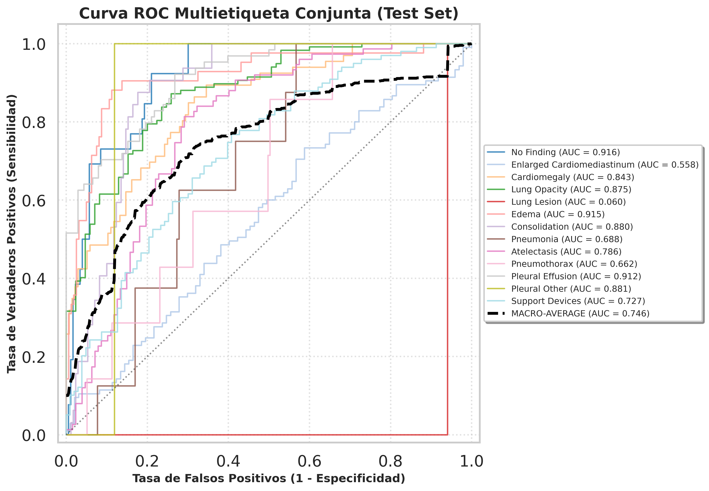
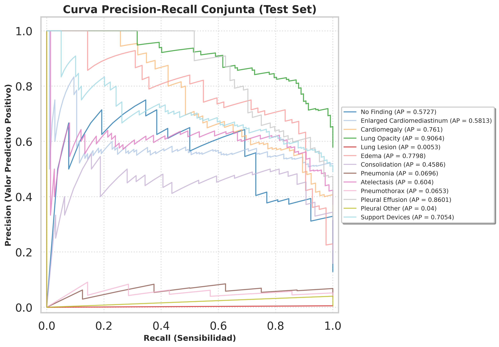
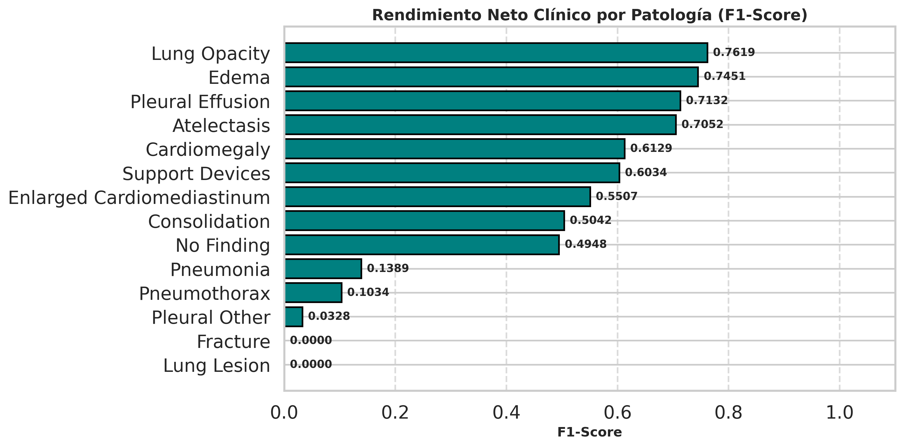
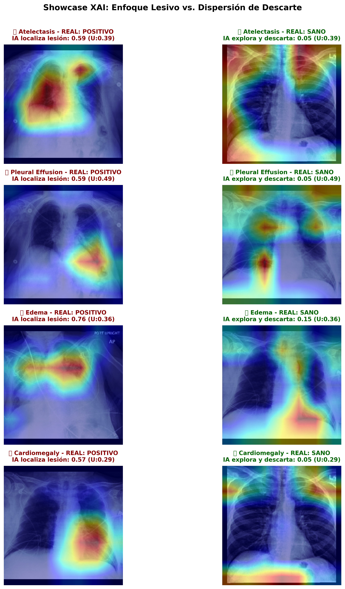
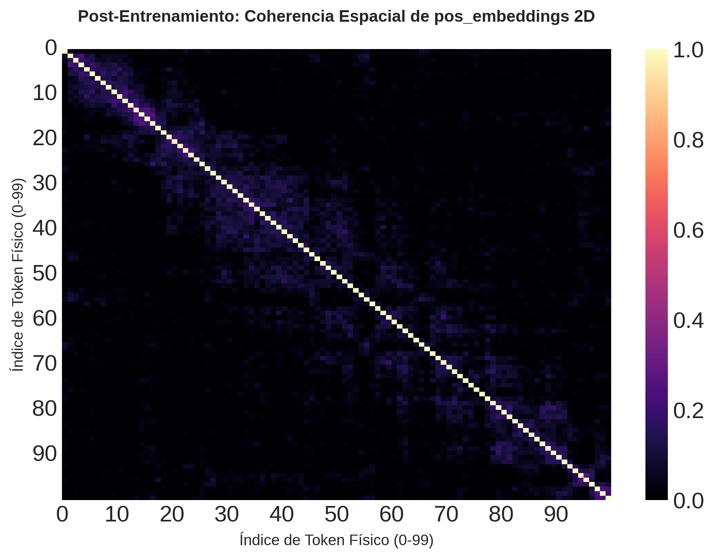
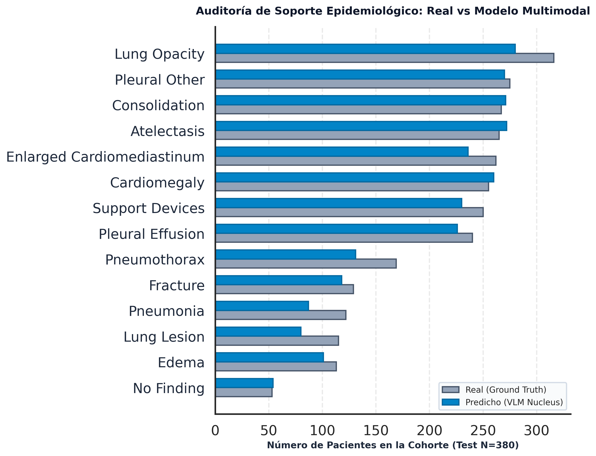

# 🧠 Vision-Language Model para la Generación Autorregresiva de Informes Radiológicos

**Proyecto de Fin de Grado en Ingeniería Informática (ETSIIT - Universidad de Granada)**  
**Autor:** Rafael Carrillo Arroyo

---

## 📋 Resumen Ejecutivo
La presente memoria detalla el diseño, desarrollo y evaluación empírica de un *pipeline* multimodal avanzado que integra visión por computador y procesamiento de lenguaje natural (NLP) para la redacción automatizada de informes radiológicos. El sistema aborda y mitiga los desafíos inherentes del **sesgo de normalidad** (*prior* lingüístico) y la **desalineación de dominio** mediante una arquitectura modular dividida en tres fases de ingeniería estricta y auditoría continua.

---

## 🏗️ Arquitectura del Sistema: Pipeline de 3 Fases

### FASE 1: Codificador Visual Clínico (Extracción de Características Espaciales)
**Objetivo:** Desarrollar una arquitectura base visual y robusta capaz de codificar la anatomía radiológica preservando la topología espacial, generando así un vocabulario fundacional para el modelo generativo.

**Estrategia Arquitectónica y de Optimización:**
* **Backbone Médico:** Adaptación de una red convolucional **DenseNet121** mediante *Weight Surgery* (transferencia de pesos preentrenados y adaptación a entrada monocanal).
* **Preservación Topológica:** Sustitución de la capa de *Global Average Pooling* convencional para extraer una **cuadrícula espacial de 10x10** (100 tokens visuales continuos de 1024 canales), aislando regiones anatómicas específicas.
* **Mitigación del Desbalanceo:** Aprendizaje multietiqueta concurrente (14 patologías) para combatir el desbalanceo extremo (*Long-Tail*) mediante la aplicación de una función de pérdida asimétrica ponderada (BCE + Pos-Weight) y el mapeo de incertidumbre clínica (*Soft Targets*).

**Rendimiento Global y Robustez (Cohorte de Test):**
El modelo demuestra una alta capacidad de separación estadística global, manteniendo la integridad estructural frente a la prevalencia masiva de clases sanas, tal como certifica el análisis del área bajo la curva de precisión-exhaustividad (PR AUC).

<div align="center">
  
  
</div>

**Rendimiento Neto Clínico (F1-Score):**
El análisis sobre el conjunto de prueba confirma un rendimiento de grado clínico, exhibiendo su mayor fiabilidad diagnóstica en patologías parenquimatosas sólidas y derrames. 

> ⚠️ **Nota Metodológica sobre Desbalanceo Extremo (Long-Tail):** Las clases *Fracture* y *Lung Lesion* registran un F1-Score de 0.000, pero por motivos estadísticos distintos inherentes a la distribución natural del *dataset*. En *Fracture*, existe una ausencia neta de casos positivos en esta partición de test (soporte estadístico nulo), inhabilitando el cálculo de la métrica (PR AUC = N/A). En *Lung Lesion*, aunque existe soporte clínico residual, su prevalencia es tan ínfima que la red no dispone de densidad de datos suficiente para generalizar sus patrones morfológicos, resultando en una sensibilidad nula frente a la clase mayoritaria sana.

<div align="center">
  
</div>

📄 **[Consultar tabla completa de métricas clínicas y umbrales (CSV)](assets/Resultados_Evaluacion/Modulo_1/test/metricas_clinicas_test.csv)**

> **Explicabilidad Clínica y Auditoría Visual (Grad-CAM):**
> 
> 
> *El mapeo térmico de activación (imagen superior) certifica empíricamente que la red convolucional fundamenta su diagnóstico en las coordenadas anatómicas correctas (ej. bases pulmonares para Derrames, parénquima para Edemas), evadiendo correlaciones espurias o el aprendizaje de atajos visuales instrumentales (Shortcut Learning).*
>
> 🔍 **Auditoría Exhaustiva (14 Patologías):** Para garantizar la interpretabilidad y seguridad del modelo, se ha generado una validación visual completa evaluando el foco de atención topológico de la red frente a todas las etiquetas clínicas del dataset.
> * 📄 **[Ver Matriz Grad-CAM Completa (14 Patologías)](assets/Resultados_Evaluacion/Modulo_1/test/GradCAM/gradcam_matriz_completa.png)**
---

### FASE 2: Puente Multimodal y Alineamiento Geométrico
**Objetivo:** Establecer el nexo de proyección entre el extractor visual y el decodificador de lenguaje (BioGPT). Esta fase opera bajo un protocolo de "Alineamiento Puro": el LLM se mantiene estrictamente congelado, recayendo la responsabilidad de proyectar la semántica visual hacia el espacio sintáctico en un perceptrón multicapa (MLP) asistido por *Embeddings* Posicionales 2D.

**Validación Arquitectónica y Estabilidad (Cohorte Test N=380):**
El diseño del puente multimodal (MLP + LayerNorm + Centrado Dinámico) logra estabilizar la inyección visual sin producir saturación en la red receptora.
* **Inmutabilidad del LLM:** Diferencia máxima absoluta nula (`Max-Diff = 0.00`), garantizando la preservación de los pesos originales de BioGPT.
* **Estabilidad Energética:** Norma L2 acotada en **32.22**, previniendo la saturación matemática de la capa Softmax.
* **Mitigación del "Efecto Cono":** Reducción drástica de la similitud coseno centrada a **0.0005**, garantizando una dispersión isótropa óptima y mitigando la anisotropía inherente de los modelos de lenguaje.

> **Demostración Geométrica de la Coherencia Espacial:**
> <div align="center">
>   
> </div>
> 
> *La matriz de afinidad evidencia empíricamente cómo el modelo logra reconstruir la topología bidimensional (2D) a partir de una secuencia plana (1D). Dado que la radiografía se procesa como una cuadrícula de 10x10, la aparición de franjas paralelas a la diagonal principal con un "salto" exacto de 10 posiciones demuestra matemáticamente que la red ha descubierto el eje vertical (las relaciones de "arriba" y "abajo"). De este modo, el proyector interioriza la estructura anatómica sin necesidad de supervisión espacial explícita. Además, la fuerte intensidad geométrica en la mitad inicial de la matriz (tokens 0-50) refleja que el modelo ancla sus coordenadas en las estructuras rígidas del tórax superior y medio (tráquea, clavículas, arco aórtico), relajando la restricción espacial hacia las bases pulmonares y el diafragma, donde la variabilidad anatómica es mayor.*

**Análisis de Inercia Lingüística y "Ceguera Clínica":**
A pesar de la correcta alineación geométrica, la evaluación clínica arroja una **Tasa Macro de Captura Patológica crítica del 6.69%**. La conservación inmutable de BioGPT provoca que su fuerte sesgo lingüístico (*prior* de normalidad) eclipse la señal visual, resultando en la generación de informes genéricos de normalidad incluso ante evidencias de lesiones severas.

> **⚠️ Ejemplo de Alucinación por Sesgo de Normalidad (Paciente con fracturas y derrame):**
> * **[INFORME ORIGINAL]:** *"Findings: Cardiomediastinal contours are unchanged. There are stable fractures... Pleural effusion..."*
> * **[TEXTO GENERADO]:** *"Normal, the heart is in normal site. No cardiomegaly or pleural effusion. Impression: The chest is clear."*

**Veredicto Metodológico:** El alineamiento unimodal de proyección pura resulta insuficiente para quebrar la inercia del modelo de lenguaje. Este hallazgo empírico valida la hipótesis de partida y fundamenta la necesidad de la transición hacia la **FASE 3**, introduciendo adaptación de dominio en el LLM.
### FASE 3: Adaptación de Dominio y Generación Condicionada (LoRA)
**Objetivo:** Erradicar el sesgo de normalidad detectado en la fase anterior mediante la inyección de adaptadores de bajo rango (**LoRA**) en las capas de auto-atención de BioGPT-Large. Se aplica un proceso de *Fine-Tuning* Supervisado (SFT) para modular la atención diagnóstica, condicionando estrictamente la generación de texto a la señal topográfica visual.

**Auditoría de Plasticidad Visual y Coherencia Semántica (Cohorte Test N=380):**
El protocolo de ablación visual (*Blind Masking*) corrobora el éxito de la intervención algorítmica, evidenciando la transición de un modelo lingüísticamente inercial a uno dependiente del estímulo visual.

* **Índice de Dependencia Visual (VDI Macro): 0.8333.** Este umbral confirma que el sistema fundamenta más del 83% de su inferencia semántica en la radiografía de entrada.
* **Calidad Semántica Contextual:** Se obtiene un BERTScore F1 de **0.8774** (Escala Absoluta), asegurando una sintaxis fluida y consistente con la terminología clínica humana.

📄 **[Consultar tabla de métricas de Lenguaje Natural (BLEU, ROUGE, BERTScore)](assets/Resultados_Evaluacion/Modulo_3/metricas_generacion_nlg.csv)**

**Rendimiento Diagnóstico Neto (Auditoría Zero-Shot NLP con BART):**
Para validar la fidelidad clínica de los informes generados, se realizó una extracción automatizada de patologías mediante un modelo externo (BART-Large-MNLI) en configuración *Zero-Shot*, comparando las entidades redactadas por el sistema frente al *Ground Truth*.

La evaluación global consolida el diagnóstico multietiqueta del texto generado:
* **F1-Score Micro (60.03% - Convergencia Estable):** Rendimiento neto ajustado al volumen poblacional, demostrando la fiabilidad general del modelo en un entorno clínico.
* **F1-Score Macro (51.45% - Estándar Académico VLM):** Rendimiento promedio por clase. Certifica un aprendizaje balanceado y robusto, alineado con el estado del arte en IA médica generativa.

A nivel de entidades específicas, el modelo exhibe una alta capacidad para documentar alteraciones morfológicas complejas directamente en lenguaje natural:

<div align="center">
  
</div>

*Se observan resultados sobresalientes en patologías de alta relevancia clínica como la **Opacidad Pulmonar (F1: 0.7617)**, la **Consolidación (F1: 0.7286)** y la **Atelectasia (F1: 0.7151)**.*

**Auditoría Epidemiológica (Distribución Observada vs. Generada):**
Esta auditoría visualiza el volumen total de diagnósticos por cada categoría patológica. En la gráfica adjunta, cada par de barras compara la prevalencia real frente a la predicción del modelo:
* **Barra Real (Ground Truth):** Representa la cantidad exacta de pacientes que realmente padecen esa patología en la cohorte de prueba, según el diagnóstico médico original.
* **Barra IA (Generada):** Representa la cantidad de casos que el modelo de lenguaje ha detectado y redactado proactivamente en sus informes.

El contraste equilibrado entre ambas barras demuestra la superación definitiva del colapso de inferencia sufrido en la Fase 2 (donde la IA predecía "Estudio Normal" por defecto debido a la inercia del texto). El modelo ahora aproxima con gran precisión la distribución multietiqueta del mundo real, confirmando que redacta de forma proporcional a la evidencia clínica y no por sesgo estadístico.

📄 **[Consultar reporte detallado de validación clínica cruzada (CSV)](assets/Resultados_Evaluacion/Modulo_3/metricas_clinicas_bart.csv)**

---
## 🛠️ Stack Tecnológico y Reproducibilidad

El *pipeline* ha sido desarrollado e iterado en entornos acelerados por GPU (NVIDIA CUDA), optimizando el uso de VRAM mediante Precisión Mixta Automática (AMP) y acumulación de gradientes.

* **Deep Learning Framework:** PyTorch & PyTorch Lightning.
* **Preprocesamiento Clínico y Visión:** MONAI (Medical Open Network for AI) para transformaciones de grado médico, y TorchVision (DenseNet121).
* **Procesamiento de Lenguaje (NLP):** HuggingFace Transformers (BioGPT, BART, SBERT).
* **Métricas y Evaluación:** Scikit-Learn, Evaluate, BERTScore.
* **Manipulación de Datos:** Pandas, NumPy, OpenCV.

> **💡 Documentación Metodológica y Código Fuente:**
> El detalle exhaustivo sobre la definición matemática de las pruebas, el diseño de las funciones de pérdida y la implementación algorítmica de cada fase se encuentra documentado de forma interactiva en la carpeta `notebooks/`. Cada cuaderno contiene explicaciones teóricas y comentarios de código diseñados para garantizar la transparencia, facilitar la auditoría del mismo y asegurar la reproducibilidad de los experimentos hechos.

---
* 📉 **Auditoría de Entrenamiento (Convergencia):** Los gráficos de estabilidad de las funciones de pérdida (*Loss*) están disponibles para la **[Fase 1 (CNN)](assets/Resultados_Evaluacion/Modulo_1/curvas_entrenamiento_final.png)**, la **[Fase 2 (Puente Multimodal)](assets/Resultados_Evaluacion/Modulo_2/grafica_convergencia_fase2.png)** y la **[Fase 3 (LoRA)](assets/Resultados_Evaluacion/Modulo_3/convergencia_fase3_lora.png)**.

---
## 📂 Recursos y Estructura del Repositorio

> **⚙️ Estrategia de Ingesta de Datos (Data Ops):**
> Por buenas prácticas de Ingeniería de Software, los corpus clínicos masivos (imágenes radiológicas) y los tensores de pesos pesados (`.pth`) **no** se incluyen en el control de versiones de GitHub. 
> El *pipeline* está diseñado para montar dinámicamente un volumen en tiempo de ejecución, extrayendo los datos en un entorno SSD local temporal para maximizar el ancho de banda I/O durante el entrenamiento.

🔗 **[Acceso al Volumen Externo en Google Drive (Datasets, Pesos y Logs)](https://drive.google.com/drive/folders/190Xspevq_DuxQ3TelS3kAR5PC_xw6rMz?usp=sharing)**

```text
TFG-Vision-Language-Clinical-Reports/
├── notebooks/       # Implementación base, código fuente y experimentación
│   ├── Modulo_I_Vision.ipynb        # Fase 1: Entrenamiento del extractor visual (CNN) y métricas
│   └── Modulo_II_Puente_Texto.ipynb # Fases 2 y 3: Proyector MLP, inyección LoRA en BioGPT y auditoría Zero-Shot
│
├── assets/          # Repositorio integral de recursos gráficos, métricas y auditorías
│   ├── Resultados_EDA/              # Análisis Exploratorio de Datos (EDA) exhaustivo
│   │   ├── Modulo_1/                # Demografía, fotometría, control de calidad y correlación de patologías
│   │   └── Modulo_2_3_Indiana/      # Inspección bimodal clínica, completitud del corpus y Bigramas (NLP)
│   └── Resultados_Evaluacion/       # Pruebas empíricas y validación algorítmica de las 3 fases
│       ├── Modulo_1/                # [Fase 1] Curvas ROC/PR individuales, matrices de confusión y Grad-CAM (14 clases)
│       ├── Modulo_2/                # [Fase 2] Convergencia del puente y demostración matemática de topología 2D
│       └── Modulo_3/                # [Fase 3] Métricas NLP (BERTScore), autopsias de contraste y CSVs de evaluación
│
├── checkpoints/     # (Ignorado en Git -> Accesible vía enlace Drive) Pesos del modelo
├── data/            # (Ignorado en Git -> Accesible vía enlace Drive) Montaje dinámico SSD
├── outputs/         # (Ignorado en Git -> Accesible vía enlace Drive) Registros de ejecución locales
└── README.md        # Documentación arquitectónica e índice del proyecto
